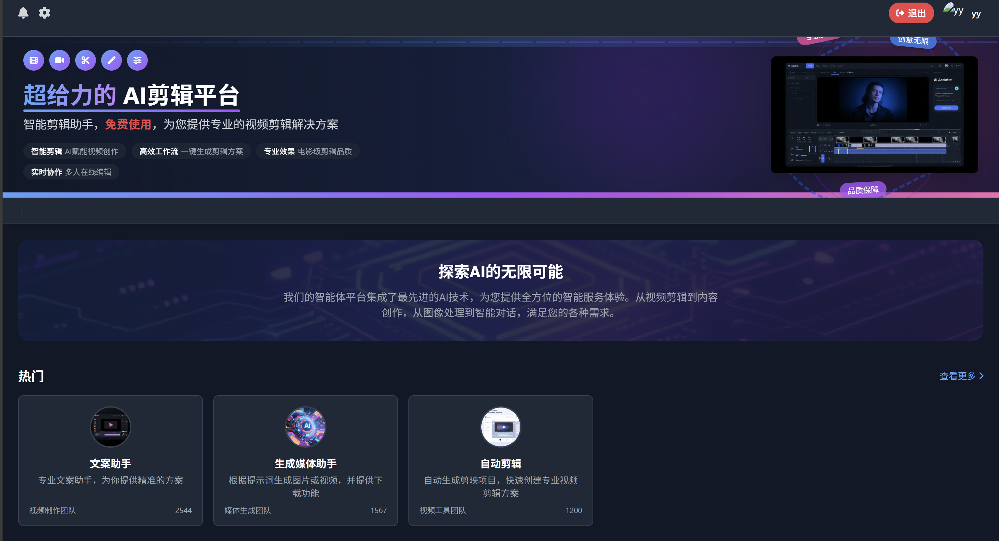
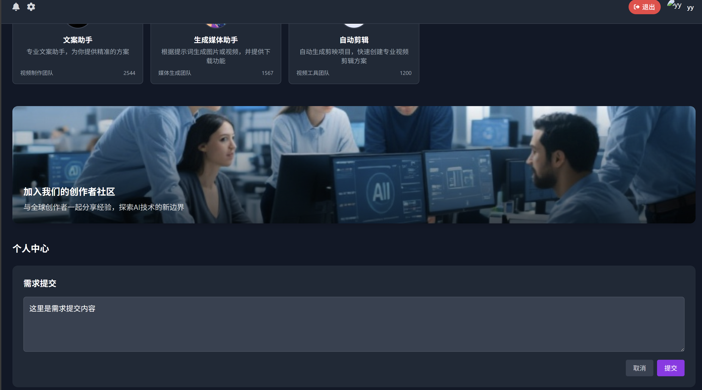
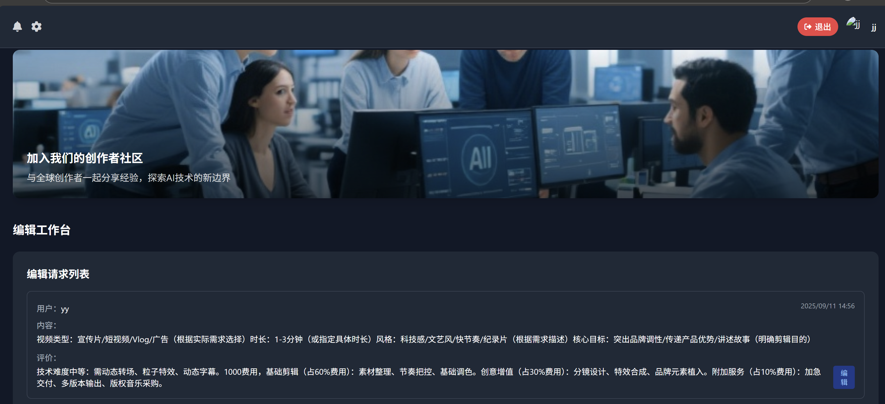

# 项目部署与使用说明

本项目集成了 LLM 服务和 Django 后台管理系统，用于剪辑任务管理和操作。

---

## 1. 环境准备

确保已安装：

- Python 3.x  
- pip（Python 包管理器）  
- Django 相关依赖  

---

## 2. 安装依赖

在项目根目录下执行：

```bash
pip install -r requirements.txt
```

---

## 3. 配置 API Key

本项目使用 `zhipuai` / BIGMODEL API，需要配置 API Key。

### Windows（PowerShell）

```powershell
setx BIGMODEL_API_KEY "你的API_KEY"
```

### macOS / Linux（bash/zsh）

```bash
export BIGMODEL_API_KEY="你的API_KEY"
```

> 配置完成后，请重新打开终端窗口或运行 `source ~/.bashrc` 以使配置生效。  
> 可用以下命令检查环境变量是否生效：  
> - Linux/macOS: `echo $BIGMODEL_API_KEY`  
> - Windows PowerShell: `$env:BIGMODEL_API_KEY`

---

## 4. 启动 LLM 服务

```bash
python llmserver.py
```

> 确保 API Key 已正确配置，服务启动后可处理 LLM 请求。

---

## 5. Django 管理与用户创建

### 创建超级管理员

```bash
python manage.py createsuperuser
```

按提示输入用户名、邮箱和密码。

### 创建剪辑师用户及角色

通过 Django 管理后台或管理命令创建以下角色：

- `superuser`（管理员）  
- `editor`（剪辑师）

---

## 6. 启动 Django 服务

```bash
python manage.py runserver 0.0.0.0:8000
```

访问方式：

- 本机访问：`http://localhost:8000`  
- 局域网访问：`http://<服务器IP>:8000`  

---

## 7. 项目目录结构示例

```
project/
│
├─ llmserver.py         # LLM 服务入口
├─ manage.py            # Django 管理命令
├─ requirements.txt     # Python 依赖
├─ loghelper.py         # 日志工具
├─ docs/
│   └─ images/          # 图片目录
├─ logs/                # 日志目录
└─ README.md            # 项目说明
```

---

## 8. 功能示意图

### 8.1 剪辑智能体封面



### 8.2 用户提交需求界面



### 8.3 剪辑师处理需求界面



---

## 9. 常见问题

- **API Key 配置无效**  
  检查环境变量是否生效，并确保终端已重启。

- **Django 服务无法启动**  
  检查端口是否被占用，或使用其他端口：
  ```bash
  python manage.py runserver 0.0.0.0:<端口号>
  ```

- **依赖安装失败**  
  尝试升级 pip：
  ```bash
  pip install --upgrade pip
  ```

- **LLM 服务无法访问**  
  确认 `llmserver.py` 已启动并监听正确端口。

---

## 10. 一键部署示例（可选）

在 Linux/macOS 可创建 `deploy.sh`：

```bash
#!/bin/bash

# 安装依赖
pip install -r requirements.txt

# 配置 API Key
export BIGMODEL_API_KEY="你的API_KEY"

# 启动 LLM 服务
python llmserver.py &

# 启动 Django 服务
python manage.py runserver 0.0.0.0:8000
```

Windows 可创建 `deploy.ps1`：

```powershell
# 安装依赖
pip install -r requirements.txt

# 配置 API Key
setx BIGMODEL_API_KEY "你的API_KEY"

# 启动 LLM 服务
Start-Process python llmserver.py

# 启动 Django 服务
Start-Process python manage.py runserver 0.0.0.0:8000
```

---

## 11. 参考文档

- [Django 官方文档](https://docs.djangoproject.com/)  
- [zhipuai /]()
