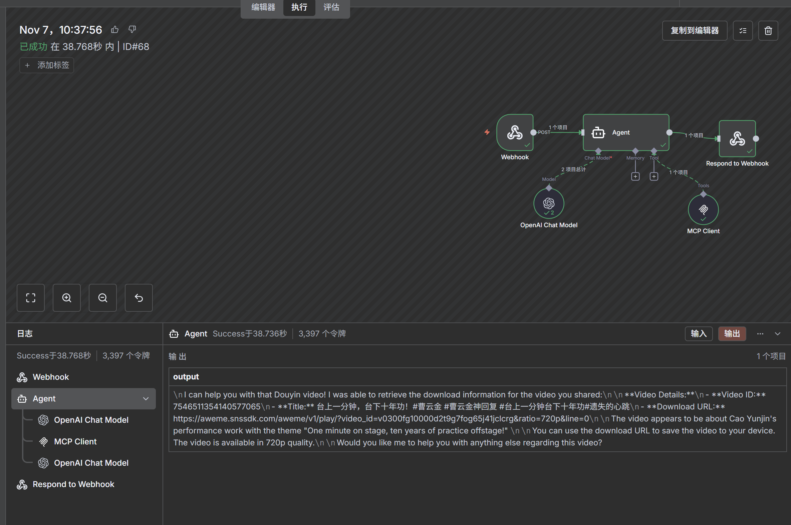
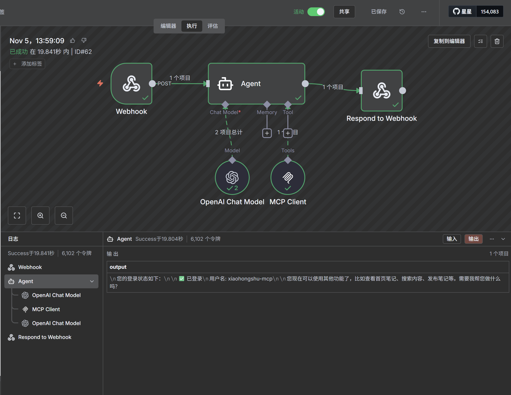
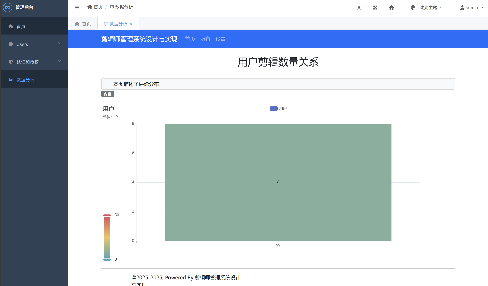
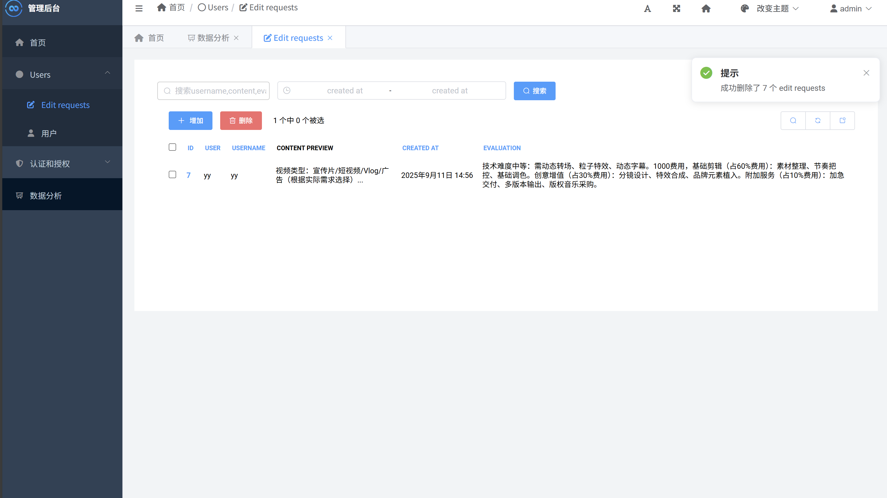
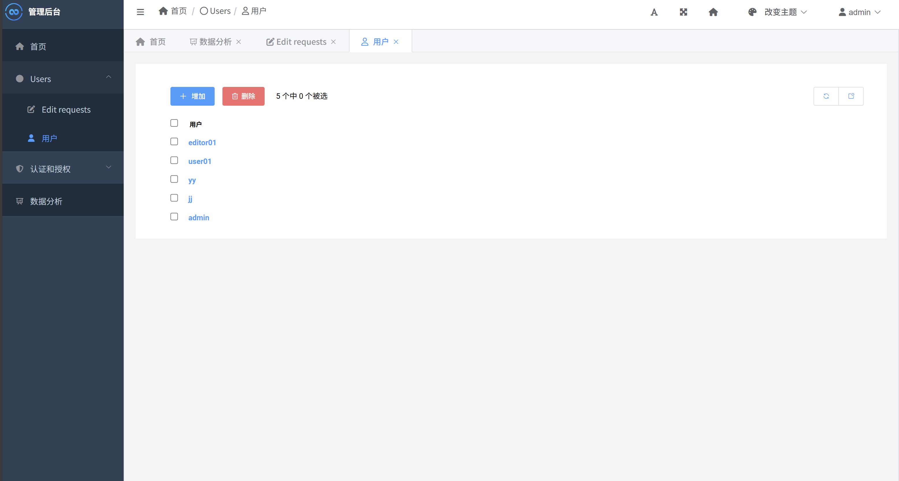
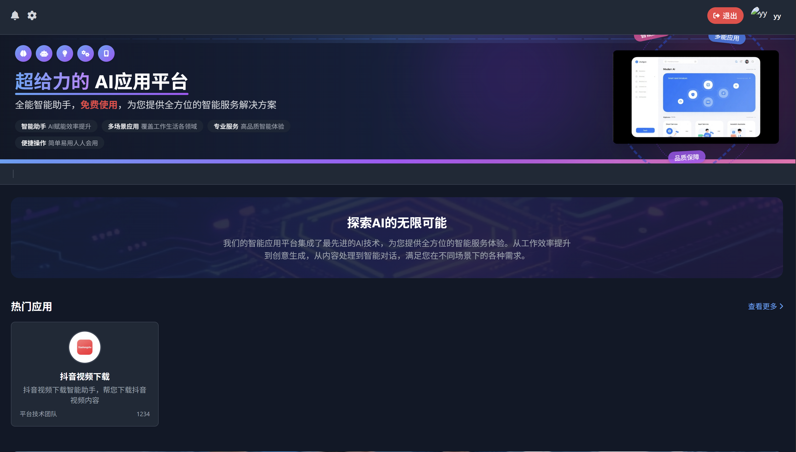
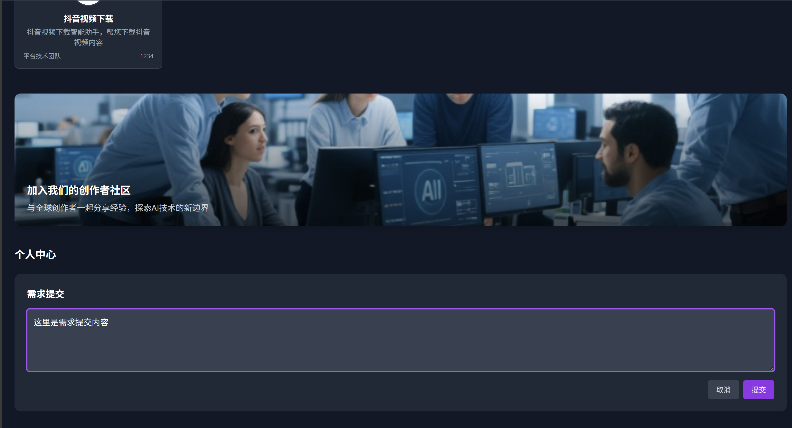
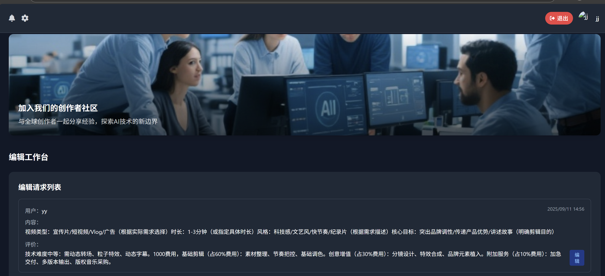

# 项目部署与使用说明

本项目集成了 **任务管理系统**、**智能体服务** 与 **n8n 自动化流程**，用于统一管理用户需求、人工任务及智能创作流程。

---

## 1. 环境准备

请确保已安装：

- **Python 3.x**  
- **pip**（Python 包管理器）  
- **Django 相关依赖**

---

## 2. 安装依赖

在项目根目录执行：

```bash
pip install -r requirements.txt
```

---

## 3. n8n 模型与 API Key 配置

本项目使用的 **大模型服务（zhipuai / BIGMODEL）** 在 **n8n 工作流中配置**，  
无需在系统环境中设置 API Key。

### 配置步骤

1. 打开 n8n 编辑界面。  
2. 导入工作流文件（示例）：`n8n/dymcp.json`。  
3. 在 **Model** 节点中填写你的 **BIGMODEL API Key**。  
4. 保存并激活工作流。

> **注意：** API Key 仅在 n8n 中使用，不需设置系统环境变量。

---

## 4. 智能体与自动化服务

本项目使用以下智能体与自动化流程：

### 4.1 智能体：dymcp  

该智能体用于下载抖音视频。
mcp运行
```bash
python douyinmcp.py
```
### 4.2 n8n 自动化流程  
目录：`n8n/dymcp.json`  
该流程通过 Webhook 实现用户请求接收与内容生成自动化。



---

## 5. Django 管理与用户创建

### 创建超级管理员

```bash
python manage.py createsuperuser
```

根据提示输入用户名、邮箱和密码。

### 创建人工用户及角色

可通过 Django 后台或命令行创建以下角色：

- `superuser`（管理员）  
- `editor`（人工）

---

## 6. 启动 Django 服务

```bash
python manage.py runserver 0.0.0.0:8000
```

访问方式：

- 本机访问：`http://localhost:8000`  
- 局域网访问：`http://<服务器IP>:8000`

后台管理界面：  
[http://127.0.0.1:8000/admin](http://127.0.0.1:8000/admin)

---

## 7. 本地开发（前端部署）

### 环境准备

- 安装 [Node.js](https://nodejs.org/en)
- 安装 [pnpm](https://pnpm.io/installation)

### 智能体添加

- `frontend\src\lib\agentConfig.ts`（配置位置，按需添加）  

```sh
// 所有智能体的配置数组
export const agentConfigs: AgentConfig[] = [
  {
    id: 'agent-1',
    name: '抖音视频下载',
    description: '抖音视频下载智能助手，帮您下载抖音视频内容',
    creator: '平台技术团队',
    views: '1234',
    avatar: 'XXXXX',
    server: {
      url: 'http://localhost:5678/webhook/xxxx',
      method: 'POST',
      timeoutMs: 600000
    },
    response: {
      type: 'synchronous',
      supportsImageUpload: false
    },
    ui: {
      placeholder: '请输入命令，例如"下载分享连接的视频：XXXXX"',
      welcomeMessage: '抖音视频下载智能助手，帮您下载抖音视频内容'
    }
  },

];
```

### 操作步骤

- 安装依赖

```sh
pnpm install
```

- 启动 Dev Server

```sh
pnpm run dev
```

- 在浏览器访问：  
  [http://localhost:3000](http://localhost:3000)

---

## 8. 功能示意图

### 8.1 智能体界面  


### 8.2 n8n 自动化流程  


### 8.3 管理员界面（Django Admin）  
- **数据分析**  
    
- **需求内容管理**  
    
- **用户管理**  
  

### 8.4 主界面  
- **主页**  
    
- **用户提交需求**  
    
- **工作人员确认需求**  
  
---

## 9. 常见问题

- **n8n 无法访问或未启动**  
  请确认 n8n 服务已运行，并确保 `dymcp.json` 已导入且激活。  

- **Model 节点报错或无法调用**  
  检查 n8n 的模型节点中是否填写正确的 API Key。  

- **Django 启动失败**  
  检查端口占用情况，可换端口：  
  ```bash
  python manage.py runserver 0.0.0.0:<端口号>
  ```

- **依赖安装失败**  
  尝试升级 pip：  
  ```bash
  pip install --upgrade pip
  ```

---

## 10. 一键部署脚本（可选）

### Linux / macOS: `deploy.sh`

```bash
#!/bin/bash
pip install -r requirements.txt
python manage.py runserver 0.0.0.0:8000
```

### Windows: `deploy.ps1`

```powershell
pip install -r requirements.txt
Start-Process python manage.py runserver 0.0.0.0:8000
```

---

## 11. 参考文档

- [Django 官方文档](https://docs.djangoproject.com/)  
- [xiaohongshu-mcp 项目](https://github.com/xpzouying/xiaohongshu-mcp)  
- [n8n 官方文档](https://docs.n8n.io)  
- [pnpm 官方文档](https://pnpm.io/)
